

# Sensitivity Analysis (SA)

## What is SENSITIVITY ANALYSIS?

## What is Sensitivity Analysis?
An Example:
<!-- .element: class="fragment fade-in" data-fragment-index="1" -->

  
  
  

Several choices to make from: 
<!-- .element: class="fragment fade-in" data-fragment-index="5" -->

  + Mode of transport
  + Route 
  + Travel cost
  + Delays of transport

<!-- .element: class="fragment fade-in" data-fragment-index="6" -->

  + Departure time
  + Total travel time
  + Comfort level
  + weather conditions

<!-- .element: class="fragment fade-in" data-fragment-index="6" -->

## What is sensitivity Analysis...?

  Sensitivity Analysis is a method used:

  + To understand relationship between inputs and outputs. 
  + To understand how changes in input variables affect the outcome of the decision or process.
  + It is also called as "what-if analysis".
  + Because it helps answer questions like, "What if this changes-how will the outcome be affected?"

<!-- .element: class="fragment fade-in" data-fragment-index="1" -->

  
  + A Tornado plot for driving car with average drive time 6.5 hours
  <!-- .element: class="fragment fade-in" data-fragment-index="2"" -->
  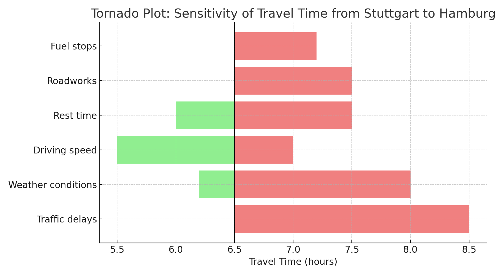

## Why is Sensitivity Analysis Important?

+ **Identifies Key Drivers:** It shows which factors most influence results/outcomes, so to know where to focus the attention.

<!-- .element: class="fragment fade-in" data-fragment-index="1" -->

+ **Reduces Uncertainty:** By understanding how changes in the inputs affect outcomes, so that better be prepared for uncertainty 
and make more robust decisions.

<!-- .element: class="fragment fade-in" data-fragment-index="2" -->

+ **Supports Decision-Making:** It helps to evaluate risks, trade-offs, and potential scenarios, making planning more informed 
and reliable.

<!-- .element: class="fragment fade-in" data-fragment-index="3" -->

## Local vs. Global Sensitivity Analysis

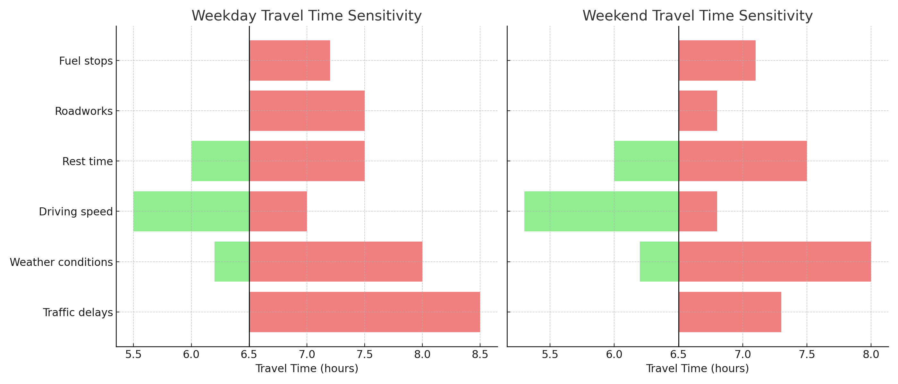

## Local vs. Global Sensitivity Analysis

## 1. Local Sensitivity Analysis

  + Evaluates how small changes to input parameters **around a specific reference point** affect the output.class

  <!-- .element: class="fragment fade-in" data-fragment-index="1" -->

  + It is often called a "one-at-a-time" (OAT) technique that analyses the impact of one parameter at a time, keeping other parameters fixed

  <!-- .element: class="fragment fade-in" data-fragment-index="2" -->

**Key Features:**

  <!-- .element: class="fragment fade-in" data-fragment-index="3" -->

  - **Derivative-based:** Measures the slope (partial derivatives) of the output with respect to each input at a fixed point.

  <!-- .element: class="fragment fade-in" data-fragment-index="4" -->

  - **Computationally efficient:** Requires few model evaluations since it only explores perturbations near the reference value.

  <!-- .element: class="fragment fade-in" data-fragment-index="5" -->

  - **Limited scope:** Results are valid only near the chosen point and may miss nonlinear effects or interactions between variables.

  <!-- .element: class="fragment fade-in" data-fragment-index="6" -->

## 2. Global Sensitivity Analysis

  - Considers the effect of variation of parameters globally in **across their entire domain** under consideration on output. 

  <!-- .element: class="fragment fade-in" data-fragment-index="1" -->

  - It accounts for **interactions between variables**. It means that if one parameter depends on the variations in 
  other parameters. 

  <!-- .element: class="fragment fade-in" data-fragment-index="2" -->

  - It also accounts for **nonlinear effects**, meaning that the output is nonlinearly related to the inputs. 

  <!-- .element: class="fragment fade-in" data-fragment-index="3" -->

  - Generally requires Monte Carlo sampling of points within the domain to capture all interactions and non-linearity variations across domain.

   <!-- .element: class="fragment fade-in" data-fragment-index="4" -->

**Key Features:**
  
   <!-- .element: class="fragment fade-in" data-fragment-index="5" -->

  - **Probabilistic:** Explores the full input space (e.g. varying multiple parameters simultaneously)

   <!-- .element: class="fragment fade-in" data-fragment-index="6" -->

  - **Computationally intensive:** Requires many model evaluations to sample diverse scenarios. 

   <!-- .element: class="fragment fade-in" data-fragment-index="7" -->

  - **Robust insights:** identifies dominant factors and interactions, even in complex systems. 

   <!-- .element: class="fragment fade-in" data-fragment-index="8" -->

## Overview: Sensitivity Analysis

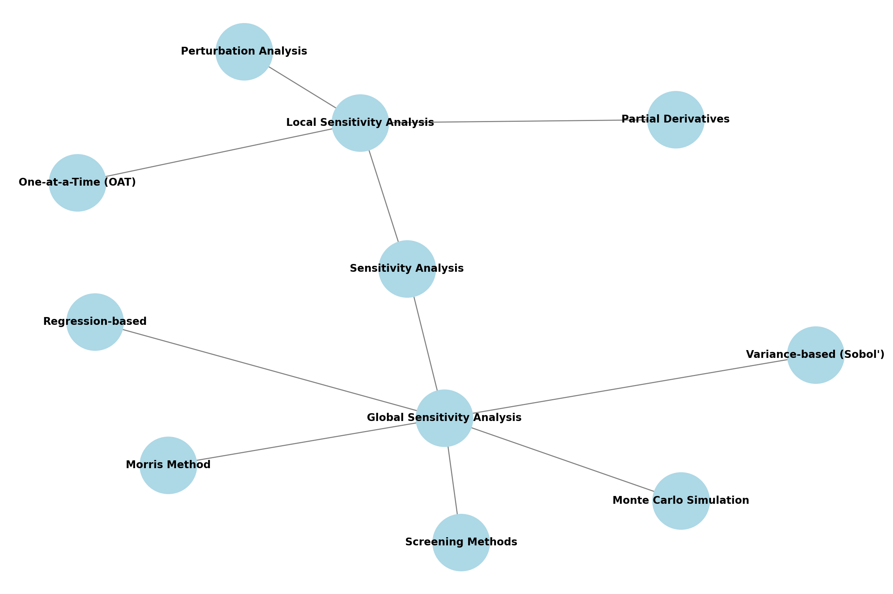

## Screening Technique

+ Large number of input variables are available in the model evaluation.

 <!-- .element: class="fragment fade-in" data-fragment-index="2" -->

+ Large models -> takes long time to evaluate each individual such as CFD simulations, FEA simulations etc.Analysis

 <!-- .element: class="fragment fade-in" data-fragment-index="3" -->

    Which factors are important and which are NOT?

 <!-- .element: class="fragment fade-in" data-fragment-index="4" -->

## Morris Sensitivity Analysis

  - Goal is to reduce the number of model evaluations for global sensitivity analysis. 

  <!-- .element: class="fragment fade-in" data-fragment-index="1" -->
  
  - One-at-a-time (OAT) method

  <!-- .element: class="fragment fade-in" data-fragment-index="2" -->

  - Gives qualitative information about importance of input parameters

 <!-- .element: class="fragment fade-in" data-fragment-index="3" -->

  - Computations of Elementary Effects (EEs)

 <!-- .element: class="fragment fade-in" data-fragment-index="4" -->

  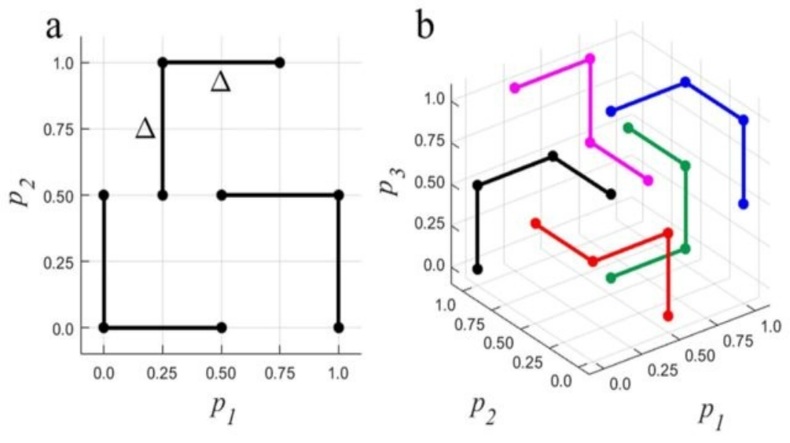

**Elementary Effects:**  
 
<!-- .element: class="fragment fade-in" data-fragment-index="6" -->

$$
EE_i(x) = \frac{[y(x_1, ..., x_{i-1}, x_i + \Delta, x_{i+1}, ..., x_k) - y(x)]}{\Delta}
$$

<!-- .element: class="fragment fade-in" data-fragment-index="6" -->

where $\Delta$ is predetermined multiple of $1/(p-1)$ and point $x = (x_1, x_2,..., x_d) \in H^d$

<!-- .element: class="fragment fade-in" data-fragment-index="6" -->

## Morris Trajectory Design 

  

    
    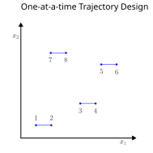
    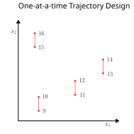
    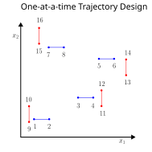
    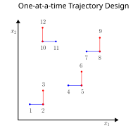
    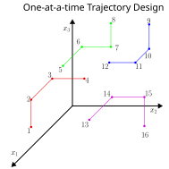
  

  
  - Lets start with 2 parameters model.
    
  <!-- .element: class="fragment fade-in" data-fragment-index="1" -->

  - For 4 EE computations for $x_1$, 8 evaluations are required.

  <!-- .element: class="fragment fade-in" data-fragment-index="2" -->

  - Similarly, for $x_2$, 8 evaluations are required for 4 EE. 

  <!-- .element: class="fragment fade-in" data-fragment-index="3" -->

  - Total 16 evaluations are required for 4 EE computations for 2 parameters.

  <!-- .element: class="fragment fade-in" data-fragment-index="4" -->

  - Intelligently placing the candidates can reduce the number of evaluations from 16 to 12. 

  <!-- .element: class="fragment fade-in" data-fragment-index="5" -->

  - Similarly, for 3 parameters model, model evaluations can be reduced from 24 to 16. 

  <!-- .element: class="fragment fade-in" data-fragment-index="6" -->

+ In general, *Morris trajectory design* can **reduce number of evaluations** from $2xr$ to $r(x+1)$, where $r$ is number of 
trajectories and $x$ is number of parameters. 

<!-- .element: class="fragment fade-in" data-fragment-index="7" -->

## Elementary Effects (EE)
### How to measure Sensitivity from EE?
<!-- .element: class="fragment fade-in" data-fragment-index="1" -->

- **Absolute Mean of $EE_i$:** Indicates the magnitude of effect or importance ranking.

<!-- .element: class="fragment fade-in" data-fragment-index="2" -->

$$
\mu^* = \frac{1}{r} \sum_{i=1}^r \left| EE_i \right|
$$

<!-- .element: class="fragment fade-in" data-fragment-index="2" -->

- **Standard Deviation of $EE_i$:** Indicates the topology of effect.

<!-- .element: class="fragment fade-in" data-fragment-index="3" -->

$$
\sigma = \sqrt{\frac{1}{r-1} \sum_{i=1}^r (EE_i - \mu_i^*)^2}
$$

<!-- .element: class="fragment fade-in" data-fragment-index="3" -->

## mean and variance terms 

  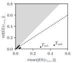

  
  + Plot between absolute mean ($\mu^* (EE_i)$) and standard deviation ($\sigma (EE_i)$). 
  + Dotted line represents $\sigma = \mu^*$ line.
  + Solid line represents $\frac{\sigma}{\mu^*} + 2 * SEM$ line
  + SEM stands for standard error of mean, given as $\sigma_x = \frac{\sigma}{\sqrt{n}}$

  + High mean value means high and mostly linear importance.
  + High standard deviation means either non-linear effects on output and/or interactions with other inputs.

## Effect topology

- $\frac{\sigma_i}{\mu_i} \leq 0.1$  

<!-- .element: class="fragment fade-in" data-fragment-index="1" -->
   
$x_i$ has an almost **Linear effect** on output.

<!-- .element: class="fragment fade-in" data-fragment-index="2" -->

- $0.1 \leq \frac{\sigma_i}{\mu_i} \leq 0.5$

<!-- .element: class="fragment fade-in" data-fragment-index="3" -->

$x_i$ has a **monotonic effect** on output.

<!-- .element: class="fragment fade-in" data-fragment-index="4" -->

- $0.5 \leq \frac{\sigma_i}{\mu_i} \leq 1$

<!-- .element: class="fragment fade-in" data-fragment-index="5" -->

$x_i$ has a **quasi-monotonic effect** on output.

<!-- .element: class="fragment fade-in" data-fragment-index="6" -->

- $\frac{\sigma_i}{\mu_i} \geq 1$

<!-- .element: class="fragment fade-in" data-fragment-index="7" -->

$x_i$ has a **nonlinear and/or interation effects**.

<!-- .element: class="fragment fade-in" data-fragment-index="8" -->

# Machine Learning (ML)

## General ML Process

  
  
  
  

## ML Classification

  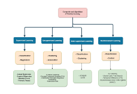
  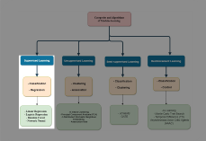
  

## Multi layer Perceptron (MLP)

  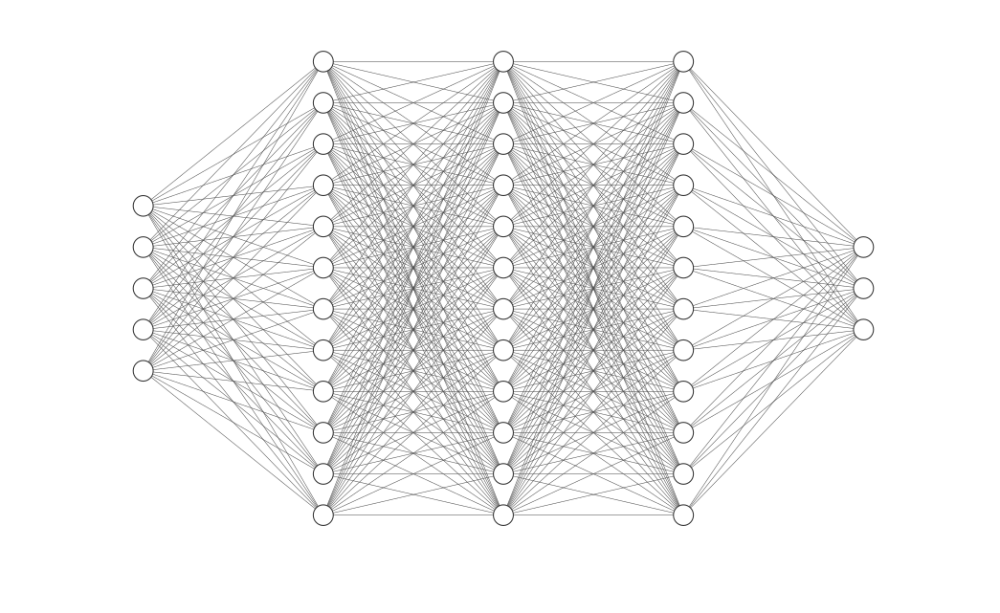
  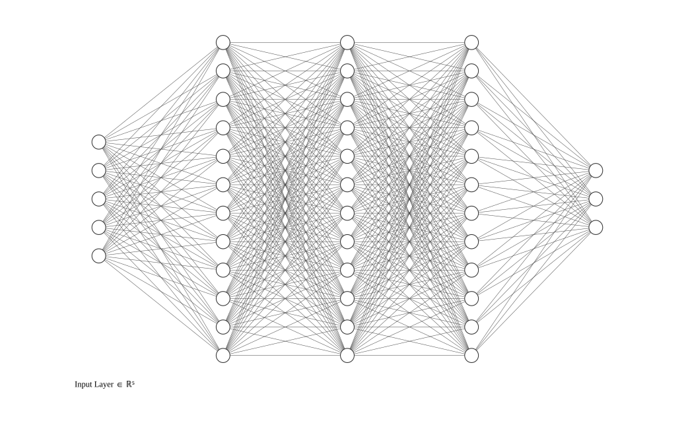
  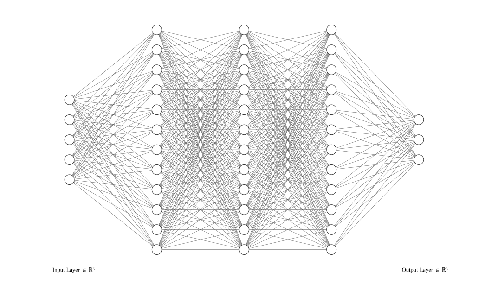
  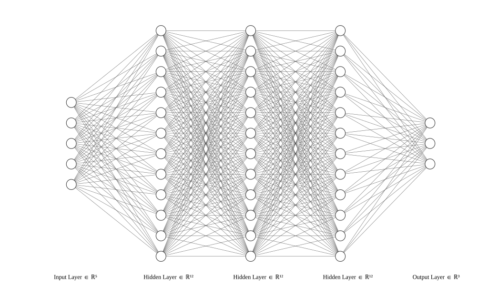

## Perceptron / Neuron

  

   
   
  

  

    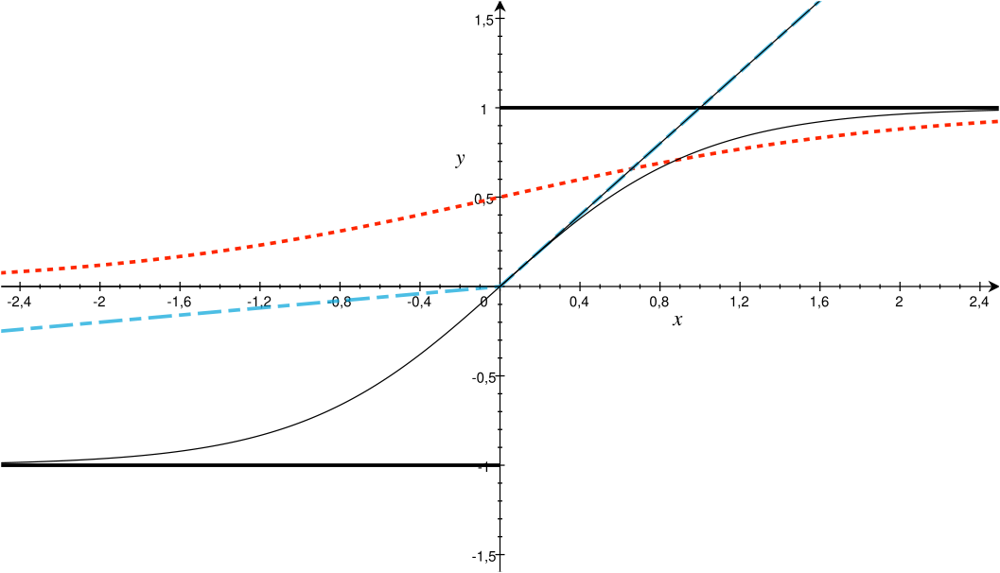
    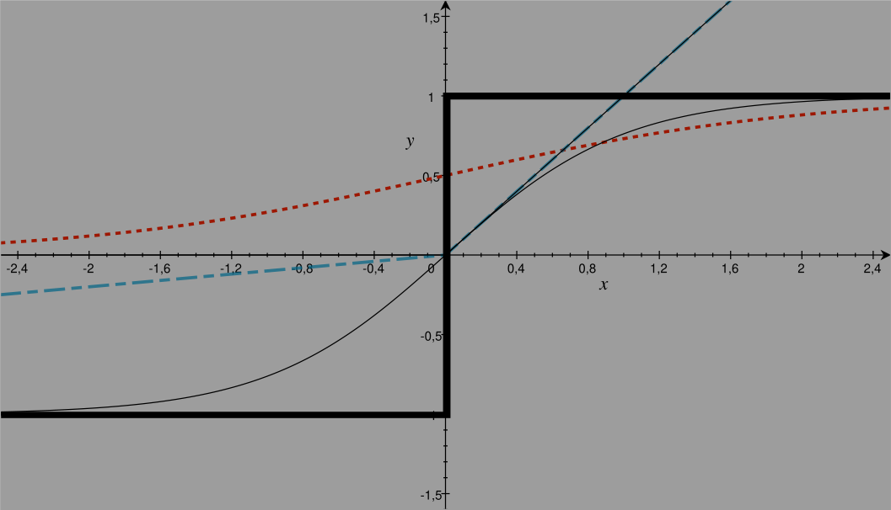
    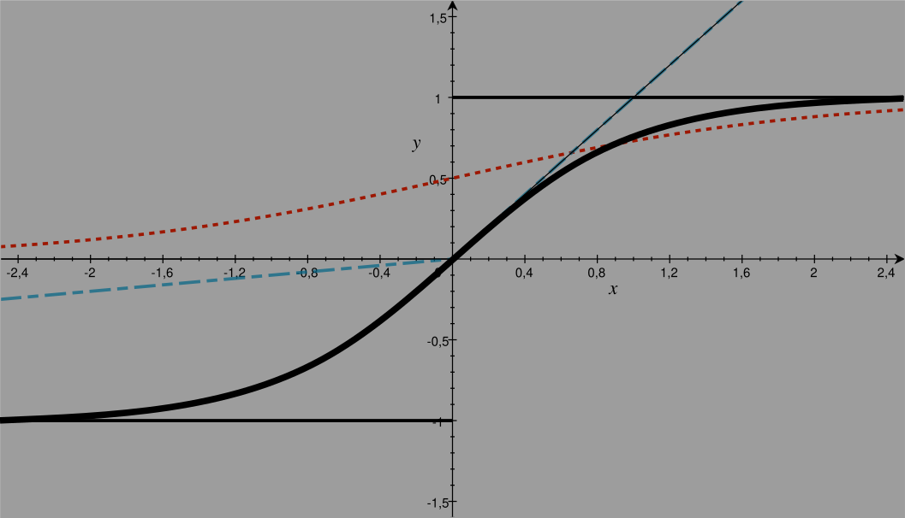
    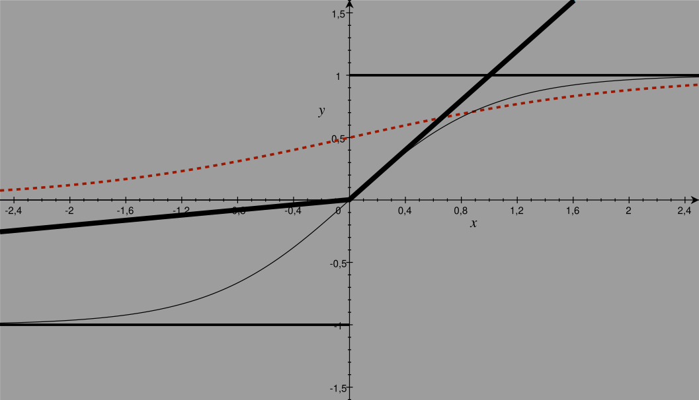
    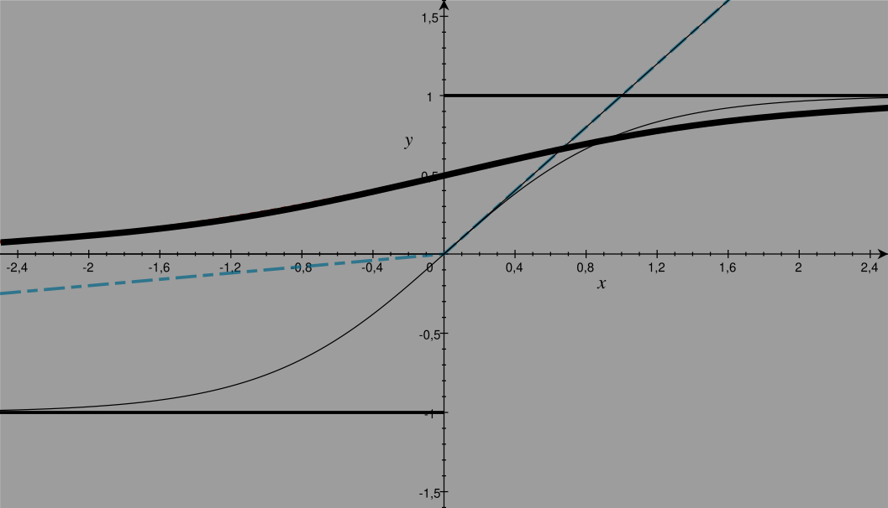
  

  - credit: Wikimedia Commons 
  <!-- .element: class="fragment" data-fragment-index="3"-->

  
  - A perceptron takes in few inputs, with corresponding weights.
  <!-- .element: class="fragment" data-fragment-index="1"-->

  - It computes the outputs as: 

    $\hat{y_i} = \sum_{i=1}^d x_i * w_i + b_i$

    where $x$ is input, $w$ is weight, and $b$ is the bias.
  <!-- .element: class="fragment" data-fragment-index="2"-->

  - Activation Functions 
  <!-- .element: class="fragment" data-fragment-index="3"-->
  - It adds non-linearity to the model.
  <!-- .element: class="fragment" data-fragment-index="3"-->
  - Different kinds of activation functions:
  <!-- .element: class="fragment" data-fragment-index="3"-->
  1. Binary step function 
  <!-- .element: class="fragment" data-fragment-index="4"-->
  2. Tanh function
  <!-- .element: class="fragment" data-fragment-index="5"-->
  3. ReLU / leaky ReLU function
  <!-- .element: class="fragment" data-fragment-index="6"-->
  4. Sigmoid function
  <!-- .element: class="fragment" data-fragment-index="7"--> 

## Training 

  - Dataset: collect a set of labeled training data:

    $D = (x_i,y_i)^N $

  - Forward pass: pass the input values from model
  - Cost/loss function: compute the loss function e.g. mean-square error(MSE)
  
    $L(\theta) = \sum_{i=1}^N ||y_i - \hat{y_i}(x_i)||^2$

  - Backpropagation:  

  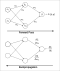  

## Training

- Backpropagation: 
    
  + Loss function depends on weights of networks $w_i$.
  + Chain-rule of differentiation is applied to compute the gradients of oss functin with respect to weights.
    
    $\frac{\partial L}{\partial w_6} = \frac{\partial L}{\partial \hat{y}} * \frac{\partial \hat{y}}{\partial w_6}$

- Optimization Step:
  
  + Update the weights according to learning rate as $w_6 \leftarrow \eta \frac{\partial L}{\partial w_6}$

    

## Training 
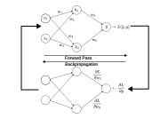

# ML in Morris Method

## Morris Method for differentiable function 

  
  
  
  

## What Exactly does it mean?

    $ EE = \frac{\partial y(x_i)}{\partial x_i} $
 
  

  - Partial derivatives of the differentiable function at the given point gives the sensitivity of the given term at that point.

  <!-- .element: class="fragment fade-in" data-fragment-index="1" -->

  - An example of 1 parameter model:

  <!-- .element: class="fragment fade-in" data-fragment-index="2" -->

  
  
  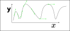

## Data-driven Model / No Differentiable function

  

    
    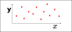
    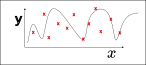
  

  
  - Let's again take 1 parameter model with no known function.

  <!-- .element: class="fragment fade-in" data-fragment-index="1" -->

  - Just dataset, from measurements or simulated (e.g. CFD/FEA etc)

  <!-- .element: class="fragment fade-in" data-fragment-index="2" -->

  - Now Machine Learning (ML) comes. ML can create a fully differentiable function to approximate the given dataset.

   <!-- .element: class="fragment fade-in" data-fragment-index="3" -->

+ Backpropagation can be used on well estimated function of ML to compute the partial derivatives.assets

<!-- .element: class="fragment fade-in" data-fragment-index="4" -->

# Test case of Hydraulic Machinery

## Axial Turbine: A Test Case
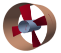

## Axial Turbine: A Test Case

  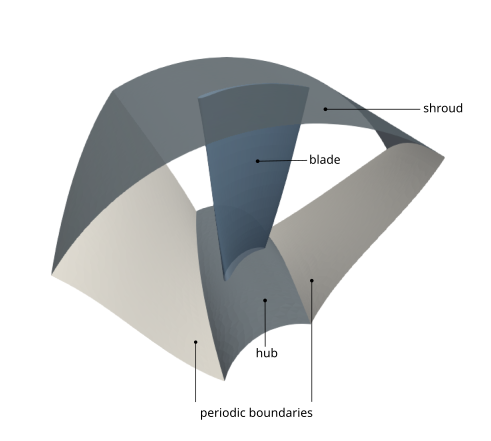  

  

+ 3 sections at hub, mid-span, and shroud.
<!-- .element: class="fragment" data-fragment-index="4"-->
+ 10 parameters at each section
<!-- .element: class="fragment" data-fragment-index="4"-->
+ Total 30 number of parameters for designing
<!-- .element: class="fragment" data-fragment-index="4"-->

# Results

## Results 
+ Presented results are for efficiency at nominal loads.
+ All results are normalized at same scale. 
+ All tests are performed 10 times and averaged for elementary effects computation. 
+ 2 lines in scatter plot represent:

  + Black solid line: Mean line, $\sigma / \mu^* = 1$
  + Red dotted line: Standard Error of Mean (SEM) line, $\sigma / \mu^* + 2*SEM $

## Classical Result

  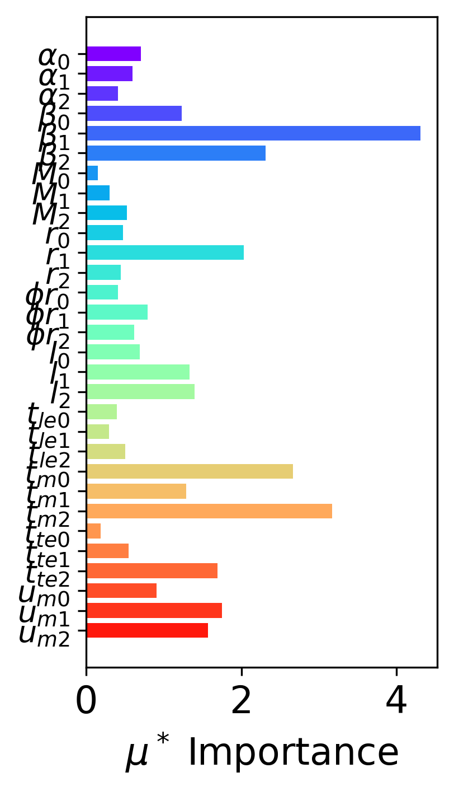

  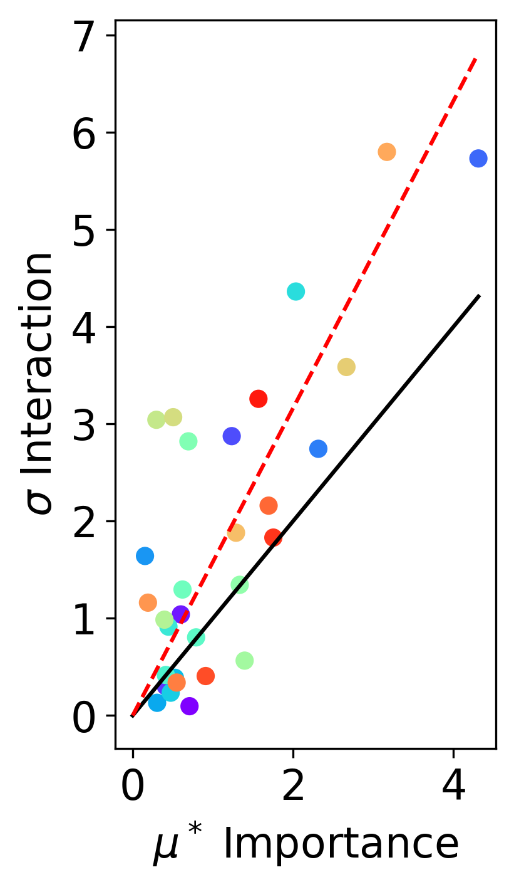

## Deep Learning Result

  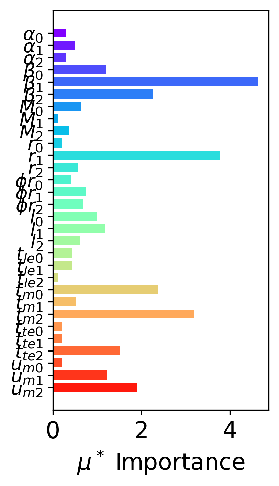

  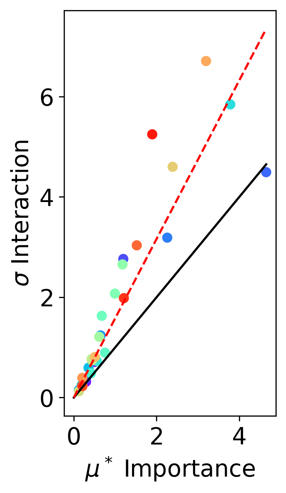

## Combined results

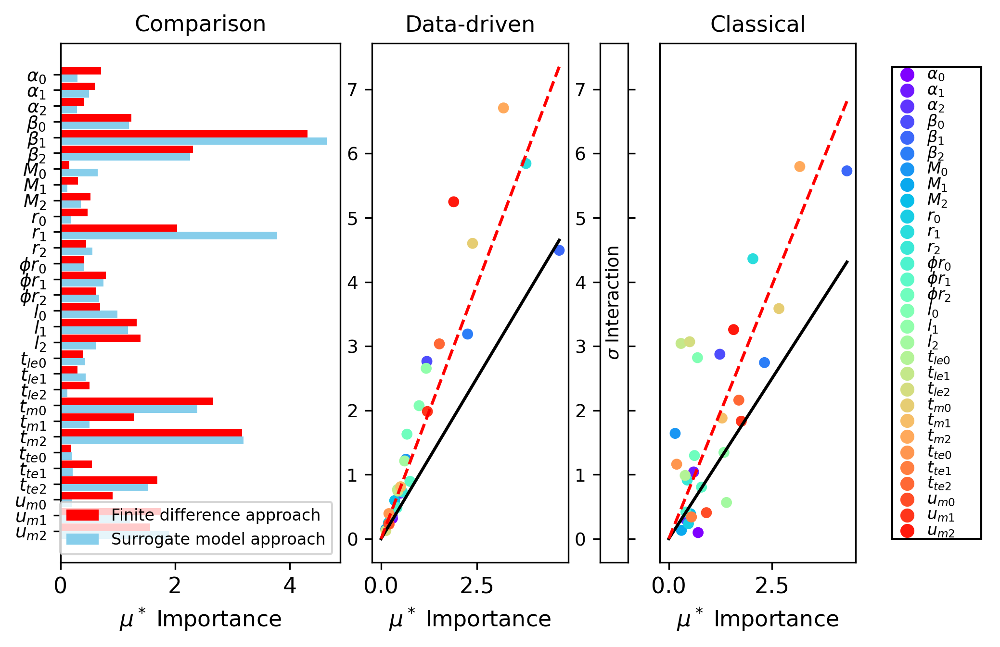

# Sources

+ Saltelli, A.: Global Sensitivity Analysis: the Primer, John Wiley & Sons, 2008.
+ Morris, M. D.: Factorial sampling plans for preliminary computational experiments. Technometrics, 33(2), 161-174, 1991.
+ Raj, R.; Tismer, A.; Gaisser, L:, Riedelbauch, S.: A deep learning approach to calculate elementary effects of morris sensitivity analysis, Proceeding in Applied Mathematics and Mechanics, 2024.
+ Fraas, S.; Tismer, A,; Riedelbauch, S.: Sensitivity study of numerical and geometrical parameters for structural mechanical analyses in the automatic design process of hydraulic machines, Proceeding of the 31st IAHR Symposium on Hydraulic Machinery and Systems, 2022.
+ Oh, M. H.; Kwon, M. W.; Park, K.; Park, B. G.: Sensitivity analysis based on neural network for optimizing device characteristics, IEEE Electron Device Letters, 41(10), 1548-1551, 2020.
