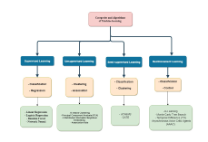
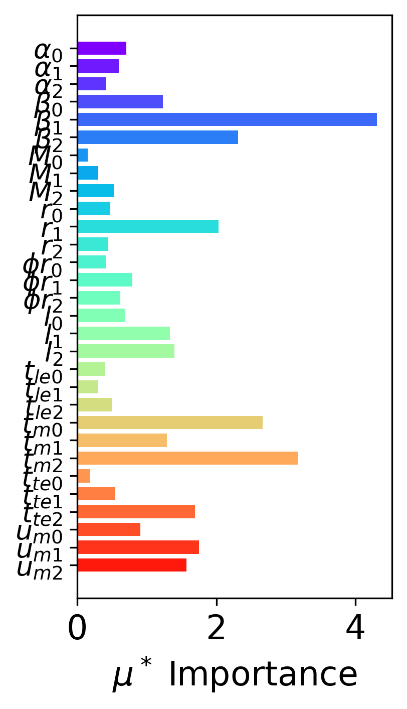

# Sensitivity Analysis (SA)

## Local vs. Global Sensitivity Analysis

### Local Sensitivity Analysis

+ Considers the effect of variation of parameters locally in close vicinity of the point in consideration
+ Derivative based (numerically or analytically) sensitivity coefficients
+ Usually follows one-at-a-time (OAT) technique that analyses the impact of one parameter at a time, keeping other parameters fixed

### Global Sensitivity Analysis

+ Considers the effect of variation of parameters globally in whole domain under consideration
+ Generally requires Monte Carlo sampling of points within the domain

## Morris Sensitivity Analysis

  - One-at-a-time (OAT) method
  - Based on method of trajectories
  - Gives qualitative information about importance of input parameters
  - Global Sensitivity Analysis method
  - Computations of Elementary Effects (EEs)

  

+ Elementary Effects:
$
EE_i(x) = \frac{[y(x_1, ..., x_{i-1}, x_i + \Delta, x_{i+1}, ..., x_k) - y(x)]}{\Delta}
$

where $\Delta$ is predetermined multiple of $1/(p-1)$ and point $x = (x_1, x_2,..., x_d) \in H^d$

<!-- .element: class="fragment fade-in" data-fregment-index="1" -->

## Morris Global Sensitivity Analysis

# Machine Learning (ML)

## General ML Process

  
  
  
  

## ML Classification

  
  
  

## Multi layer Perceptron (MLP)

  
  
  
  

## Perceptron / Neuron

  

   
   
  

  

    
    
    
    
    
  

  - credit: Wikimedia Commons 
  <!-- .element: class="fragment" data-fragment-index="3"-->

  
  - A perceptron takes in few inputs, with corresponding weights.
  <!-- .element: class="fragment" data-fragment-index="1"-->

  - It computes the outputs as: 

    $\hat{y_i} = \sum_{i=1}^d x_i * w_i + b_i$

    where $x$ is input, $w$ is weight, and $b$ is the bias.
  <!-- .element: class="fragment" data-fragment-index="2"-->

  - Activation Functions 
  <!-- .element: class="fragment" data-fragment-index="3"-->
    + It adds non-linearity to the model.
     <!-- .element: class="fragment" data-fragment-index="3"-->

    + Different kinds of activation functions:
      1. Binary step function 
      <!-- .element: class="fragment" data-fragment-index="4"-->
      2. Tanh function
      <!-- .element: class="fragment" data-fragment-index="5"-->
      3. ReLU / leaky ReLU function
      <!-- .element: class="fragment" data-fragment-index="6"-->
      4. Sigmoid function
      <!-- .element: class="fragment" data-fragment-index="7"--> 

## Training 

  + Dataset: collect a set of labeled training data:
  
  $\mathcal{D} = \left{(x_i,y_i) \right}^N $

  + Forward pass: pass the input values from model

  + Cost/loss function: compute the loss function e.g. mean-square error(MSE)

  $\mathcal{L}(\theta) = \Sum_{i=1}^N ||y_i - \hat{y_i}(x_i)||^2$

  

# ML in Morris Method

## Axial Turbine: a Test Case

    

  

+ 3 sections at hub, mid-span, and shroud.
<!-- .element: class="fragment" data-fragment-index="3"-->
+ 10 parameters at each section
<!-- .element: class="fragment" data-fragment-index="3"-->
+ Total 30 number of parameters for designing
<!-- .element: class="fragment" data-fragment-index="3"-->

## Classical Result

  

  

## Deep Learning Result

  

  

## Combined results

# Sources

+ Saltelli, A.: Global Sensitivity Analysis: the Primer, John Wiley & Sons, 2008.
+ Morris, M. D.: Factorial sampling plans for preliminary computational experiments. Technometrics, 33(2), 161-174, 1991.
+ Raj, R.; Tismer, A.; Gaisser, L:, Riedelbauch, S.: A deep learning approach to calculate elementary effects of morris sensitivity analysis, Proceeding in Applied Mathematics and Mechanics, 2024.
+ Fraas, S.; Tismer, A,; Riedelbauch, S.: Sensitivity study of numerical and geometrical parameters for structural mechanical analyses in the automatic design process of hydraulic machines, Proceeding of the 31st IAHR Symposium on Hydraulic Machinery and Systems, 2022.
+ Oh, M. H.; Kwon, M. W.; Park, K.; Park, B. G.: Sensitivity analysis based on neural network for optimizing device characteristics, IEEE Electron Device Letters, 41(10), 1548-1551, 2020.
